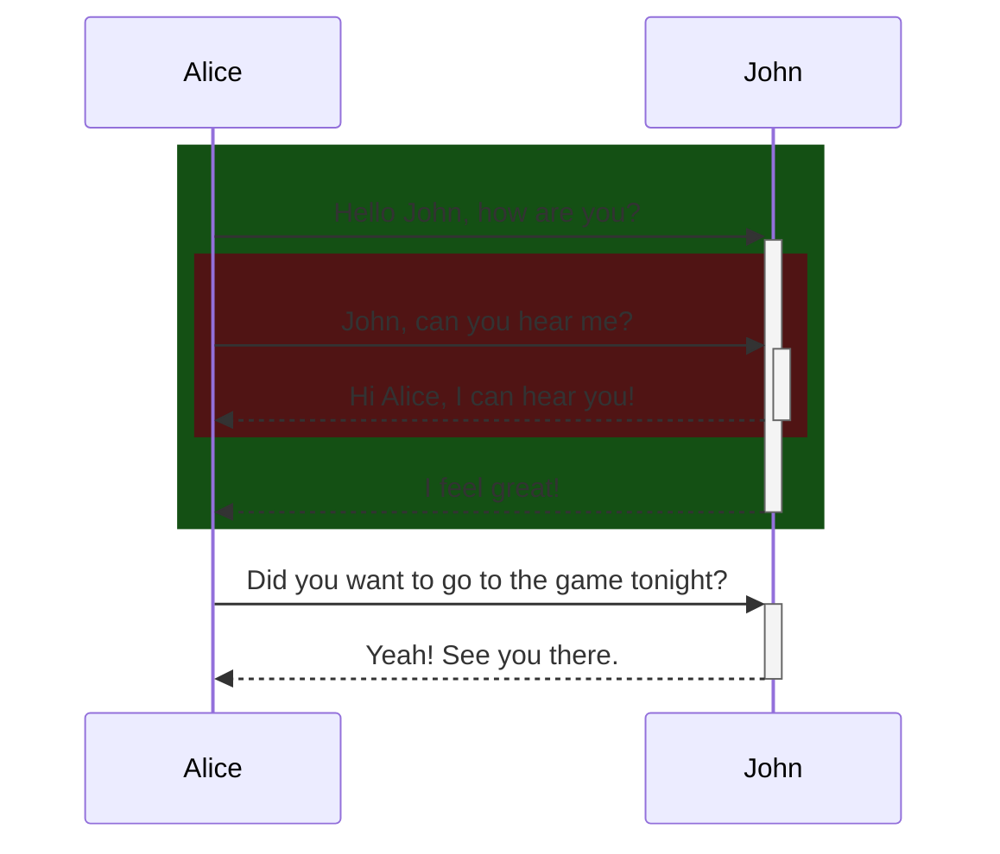

```mermaid
sequenceDiagram  
    participant Alice  
    participant John  
  
    rect rgb(20,80,20)  
    Alice->>+John: Hello John, how are you?  
    rect rgb(80,20,20)  
    Alice->>+John: John, can you hear me?  
    John-->>-Alice: Hi Alice, I can hear you!  
    end  
    John-->>-Alice: I feel great!  
    end  
    Alice ->>+ John: Did you want to go to the game tonight?  
    John -->>- Alice: Yeah! See you there.
```