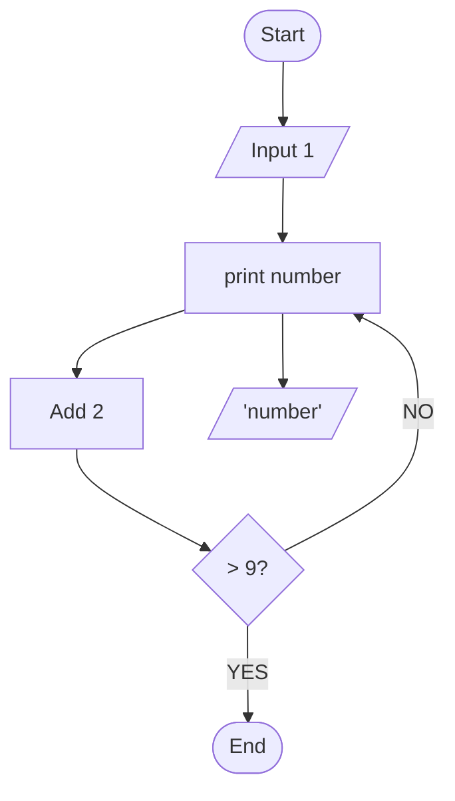

```mermaid
flowchart
	s([Start]) --> input[/Input 1/]
	input --> print[print number]
	print --> add2[Add 2] & out[/'number'/]
	add2 --> isGreater{> 9?}
	isGreater --NO--> print
	isGreater --YES--> e([End])
```